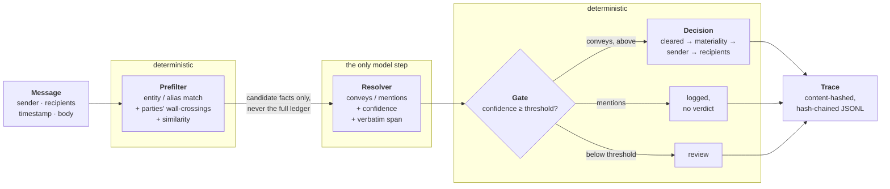
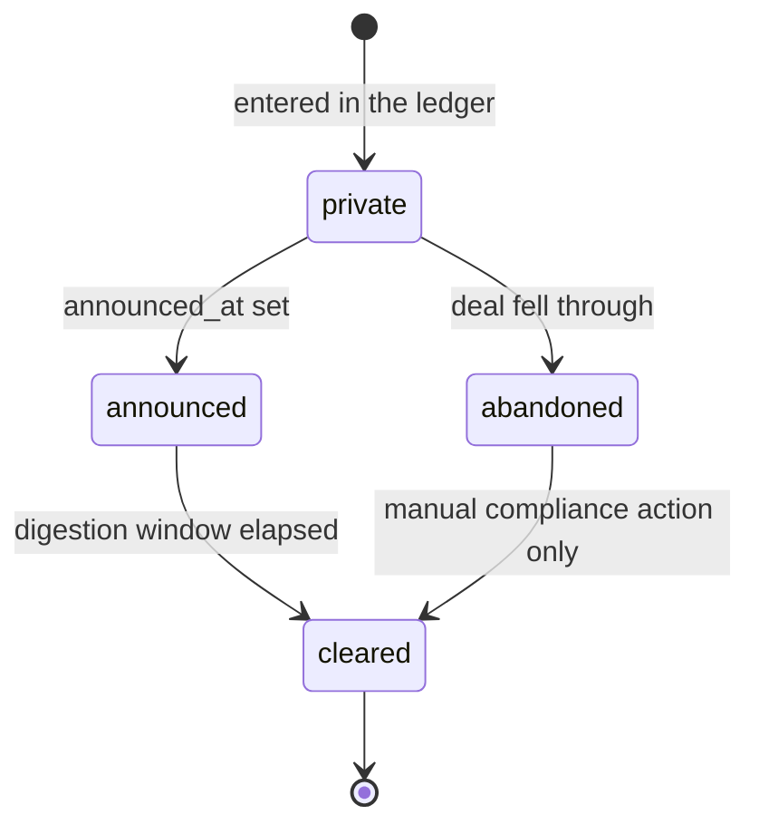
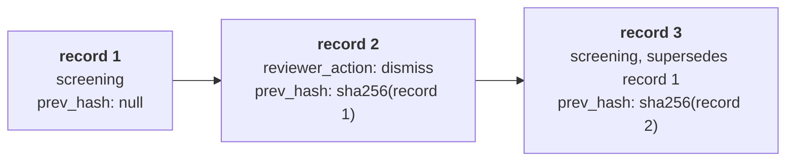

<div align="center">

# Embargo
### MNPI screening where the model reads and the code decides

<p>
  
  
  
  
  
  
</p>

**Embargo** screens messages for material non-public information (MNPI). It never asks a model *"is this a violation?"*. It asks only *"which known facts does this message convey?"*, and a deterministic decision layer computes the verdict from the fact's state, its timeline, and who had been wall-crossed onto it **at the moment the message was sent**. Every verdict leaves a tamper-evident trace that a reviewer can reconstruct without reading any code.

> MNPI is not a property of message text. It is a property of a *fact*, and of *when it was said to whom*.

[The Idea](#what-makes-this-different) · [See It Work](#see-it-work) · [Architecture](#system-architecture) · [Features](#features) · [Verified Findings](#verified-findings) · [Quick Start](#quick-start) · [Design Decisions](#key-engineering-decisions)

</div>

---

## What Makes This Different

Most screening treats MNPI as a text-classification problem: hand the message to a model, get back a risk score. That is the wrong layer to put judgment at.

| Typical Screening | Embargo |
|---|---|
| A model decides whether a message is a violation | The model only names which *known facts* a message conveys. The verdict is pure logic over the ledger, so every error traces to either the resolver or the ledger |
| The same text gets the same answer forever | The same text gets a different, correct answer depending on **when** it is screened and **who** received it |
| Access is inferred ("Alice works with Bob, who's cleared") | Wall-crossing is **explicitly non-transitive**. Nothing is ever authorized by someone else's authorization, because that inference is exactly the violation being hunted |
| A fact logged late leaves history unexamined | Re-screens affected messages against the corrected ledger and appends superseding traces. Originals are never mutated |
| Logs are mutable rows | Traces are append-only JSONL, each record carrying the SHA-256 of the one before it. Edit any record and verification reports where the chain breaks |
| One accuracy number | Resolver precision/recall, prefilter recall, and end-to-end verdict accuracy are reported **separately**. The adversarial corpus is never merged into the main one |
| Reviewers get a verdict and a score | Reviewers get the evidence chain: the message with the resolved span highlighted, every check with its inputs and result, the fact's timeline, and which backend produced the resolution |
| A confidence score is a soft suggestion | One confidence gate. Below it, a message goes to `review`. It is never silently dropped and never silently passed |

---

## See It Work

The reason to build this at all: **the same message, screened at different timestamps and against different recipients, produces different verdicts, and each one is correct.**

One fact, one access graph. `alice` is only wall-crossed from March. `bob` and `carol` are crossed from day one. `dave` never is.

```bash
embargo ledger add --id F001 --summary "Acme is being acquired by Beta" \
  --entities Acme --recorded-at 2026-01-01T00:00:00 --materiality high --db demo.db
embargo ledger transition F001 announced --announced-at 2026-01-02T00:00:00 --db demo.db

embargo cross add --party alice --fact F001 --effective-from 2026-03-01T00:00:00 --db demo.db
embargo cross add --party bob   --fact F001 --effective-from 2026-01-01T00:00:00 --db demo.db
embargo cross add --party carol --fact F001 --effective-from 2026-01-01T00:00:00 --db demo.db
```

Now screen **one message** (`alice → bob: "ACME news"`) three ways:

```console
$ embargo screen --message M001 --as-of 2026-02-01T00:00:00 --db demo.db ...
violation_upstream_leak

$ embargo screen --message M001 --as-of 2026-06-01T00:00:00 --recipients carol --db demo.db ...
clean

$ embargo screen --message M001 --as-of 2026-06-01T00:00:00 --recipients dave --db demo.db ...
violation_disclosure
```

| Screened as of | Recipient | Verdict | Why |
|---|---|---|---|
| Feb 2026 | bob | `violation_upstream_leak` | The **sender** was not yet wall-crossed. Checked first, because an unauthorized sender is a stronger finding than an unauthorized recipient |
| Jun 2026 | carol | `clean` | Sender crossed in March, carol crossed from day one |
| Jun 2026 | dave | `violation_disclosure` | Sender is authorized. The **recipient** never was |

<details>
<summary><b>What a trace record looks like</b> (real output, trimmed)</summary>

```jsonc
{
  "record_type": "screening",
  "message_id": "M001",
  "verdict": "violation_upstream_leak",
  "candidates": [
    { "fact_id": "F001", "reasons": ["entity_match", "party_authorization", "semantic_match"] }
  ],
  "fact_results": [{
    "fact_id": "F001", "mode": "conveys", "confidence": 0.9, "span": "ACME news",
    "proceeded": true,
    "checks": {
      "is_cleared": false,
      "materiality": "high",
      "sender_authorized": false,
      "recipient_authorized": { "bob": true }
    },
    "verdict": "violation_upstream_leak"
  }],
  "ledger_version": 4,
  "backend": "fake", "model_version": "fixtures",
  "supersedes": null,
  "trace_id": "288baff8…",   // SHA-256 of the record's own content
  "prev_hash": null          // SHA-256 of the previous line: the hash chain
}
```

Every candidate carries the reason it surfaced, every resolution carries the checks computed from it, and the record carries the `ledger_version` it was decided against. That is enough to reconstruct the verdict without re-running anything.

</details>

---

## System Architecture



The line the whole design rests on: **the resolver's prompt contains a fact's id, summary, entities, and aliases, and never its state, its timestamps, or any question about materiality or violation.** The model cannot be wrong about the ledger, because it never sees it. `decision.py` never imports the resolver, so it is fully testable with no model in the loop (100% covered).

### Fact lifecycle

A fact moves through exactly these paths, enforced in `ledger.py`. Anything else raises.



`abandoned` never clears on its own. Screening a message that references an abandoned deal is still a violation if any party is uncrossed.

### Decision precedence

For each resolved fact, checks run in this order and the first to fire decides. All of them are still **computed** every time, so the trace can show every input even when an earlier check settled the verdict.

| # | Check | Outcome if it fires |
|---|---|---|
| 1 | Fact is cleared at the message's timestamp | `clean` |
| 2 | Materiality at that timestamp is `none` | `clean` |
| 3 | **Sender** not wall-crossed at that timestamp | `violation_upstream_leak` |
| 4 | Any **recipient** not wall-crossed at that timestamp | `violation_disclosure` |
| 5 | None of the above | `clean` |

A message's verdict is the most severe across all the facts it resolved: `violation_upstream_leak` > `violation_disclosure` > `review` > `clean`.

### Tamper-evident trace



Re-screens and reviewer actions **append**. Nothing is ever rewritten.

---

## Features

### Fact Ledger and Access Graph
SQLite-backed ledger with a real state machine, plus a wall-crossing graph with effective-from / effective-until windows. Materiality is a **time series** (`effective_from`, `level`) looked up at the message's timestamp, never re-assessed per message. Authorization is a direct lookup and never transitive.

### Late-Fact Re-screening
A fact entered after the messages that concerned it is the ledger's single point of failure, so Embargo detects it after the fact. Facts carry `valid_from` (when it became true), `recorded_at` (when the ledger learned it), and the trace carries the `ledger_version` it was screened against. `ledger add` re-screens affected messages automatically, and `embargo rescreen --since <version>` does it in bulk. Each re-screen appends a superseding trace, and the report shows only the verdicts that changed.

### Threshold Calibration
`embargo calibrate` sweeps the gate threshold from 0.0 to 1.0 and reports resolver precision, resolver recall, share of messages routed to `review`, and end-to-end accuracy at every point, plus the best threshold for a review-volume budget. It also tells you when its own answer is degenerate (see [Verified Findings](#verified-findings)) rather than printing one authoritative-looking number.

### Two Evaluation Corpora, Reported Separately
- **Main corpus:** 30 hand-written messages over 23 fictional facts, covering the nine required hard cases (euphemism with no entity named, a fact referenced before and after `cleared_at`, a recipient crossed *after* the message was sent, an abandoned deal, two facts in different states, and more).
- **Adversarial corpus:** 8 messages over 6 facts, built to break a resolver: deliberate misdirection, a fact split across a thread so no single message conveys it, an entity name that collides with a common word, an alias that appears innocently, near-identical messages differing by one clause, and a fact conveyed only inside a quoted reply. It is meant to look bad and is never merged into the main numbers.

Both run from fixtures with no network access.

### Similarity Prefilter, and Prefilter Recall as Its Own Metric
Entity/alias matching and party wall-crossings always run. A stdlib bag-of-words cosine similarity is unioned in as a third mechanism, and every candidate records which mechanisms surfaced it. Prefilter recall (how often the correct fact reached the resolver *at all*) is reported on its own, because a prefilter miss is invisible to every resolver metric and looks exactly like a clean verdict.

### Tamper-Evident Traces
Every record carries `trace_id` (SHA-256 of its canonical content) and `prev_hash` (SHA-256 of the previous raw line). `embargo trace verify` walks the chain and reports the first break. Hashing is byte-exact (`newline=""` on every read and write), so a Windows checkout can't manufacture a false tamper report.

### Reviewer UI
A local web UI in the standard library alone, with no framework:
- **Queue** of `review` and violation verdicts, most severe first, each with a status (open, escalated, confirmed, dismissed).
- **Per finding, the full evidence chain:** the message with the resolved span highlighted, what surfaced each candidate, the resolver's output beside its backend and model version, every deterministic check with its inputs and result, each fact's state, timeline, and materiality series, and the authorization lookup for every party.
- **Confirm, dismiss (with a reason), or escalate.** Each action appends to the same hash-chained trace, and `trace verify` still passes afterward.
- **Read-only trace viewer** listing every record with the chain's verification status.

A dismissal applies to that one trace, not the message. If a re-screen recomputes the verdict, the new finding comes back as open.

### Batch and Service Mode
`embargo screen --batch <file>` bulk-screens with a per-verdict summary, and `embargo serve` runs an HTTP endpoint that takes one message and returns a verdict and trace id. Single-message, batch, and HTTP screening all call the same function, so the same input produces the same trace from any of them.

### Config and In-Place Migrations
An optional TOML config (`--config`) with a strict precedence: explicit CLI flag > config file > built-in default. Databases created by an earlier version upgrade in place when opened. A missing column is added and backfilled rather than requiring a rebuild.

### Bring Your Own Resolver
The resolver is a one-method `Protocol` whose shape is frozen. `ModelResolver` wraps any prompt-in / JSON-out callable, retries once on malformed output, and then routes the message to `review` rather than guessing. Every resolution is validated: its span must appear verbatim in the message, and its fact must be one of the candidates the resolver was shown. Every trace records the backend and model version that produced its resolutions.

---

## Verified Findings

Each of these is asserted by a test in the suite, not just described.

| Finding | Evidence |
|---|---|
| **One message, three verdicts.** The same text produces `violation_upstream_leak`, `clean`, and `violation_disclosure` depending only on what the ledger and access graph knew at the time asked about | `test_screen_same_message_three_ways_yields_three_different_verdicts`, and the demo above, run in a clean virtualenv from a non-editable install |
| **A late fact changes history.** A message screened `clean` before its fact existed becomes `violation_upstream_leak` once the fact is entered with an earlier `--valid-from`. The original trace is untouched and a superseding trace links to it | `test_ledger_add_auto_rescreens_affected_messages`: `M100: clean -> violation_upstream_leak` |
| **Edit one record, and the chain says so.** Hand-editing line 2 of a three-record trace makes `verify_chain` report a break at line 3, the first record whose link no longer matches | `test_verify_chain_detects_hand_edited_record`, and the same check through the CLI |
| **Prefilter recall exposes what resolver metrics cannot.** On the adversarial corpus (fixture run), a fact split across a thread never reaches the resolver at all. Prefilter recall drops to 0.667 while that miss shows up in no resolver metric and reads as `clean` | `test_prefilter_recall_reflects_a_true_miss`, and `embargo eval --adversarial` |
| **Verdict accuracy can hide resolver errors, which is why the metrics are never merged.** On the same adversarial run, verdict accuracy is 0.750 while resolver precision and recall are both 0.333, because a wrong fact attribution can still land on the right verdict when everyone happens to be authorized | `test_adversarial_resolver_metrics_are_well_below_one` and `test_adversarial_verdict_accuracy_is_not_perfect_but_not_zero` |
| **The calibrator reports when its own recommendation is degenerate.** Resolver recall is monotone non-increasing in the threshold and review share at threshold 0 is always 0, so "maximize recall under a review budget" always lands on the lowest threshold and the budget never binds. The report says so and also names the threshold where verdict accuracy peaks | `test_best_threshold_for_budget_always_picks_the_floor_because_recall_is_monotone` |
| **A reviewer's action can't corrupt the audit trail.** A confirm/dismiss/escalate appends to the chain, `trace verify` still passes, and `rescreen` and `trace show` keep working with reviewer records in the file | `test_record_reviewer_action_keeps_chain_intact`, `test_rescreen_does_not_crash_when_a_reviewer_action_is_in_the_trace_file` |
| **A dismissal cannot swallow a later re-screen.** Dismiss a finding, re-screen, and the recomputed finding is back in the queue as open | `test_dismissal_is_scoped_to_the_trace_not_the_message` |
| **Three entry points, one trace.** `--message`, `--batch`, and the HTTP endpoint produce field-for-field identical records and identical `trace_id`s for the same input. Config presence or absence does not change the `trace_id` either | `test_batch_and_single_message_screening_produce_byte_identical_traces`, `test_screen_endpoint_produces_byte_identical_trace_to_cli`, `test_no_config_and_explicit_fake_backend_config_produce_identical_trace_id` |

---

## Tech Stack

| Layer | Technology |
|---|---|
| Language | Python 3.11+ |
| Ledger, access graph | SQLite via stdlib `sqlite3` |
| Audit trail | JSONL, SHA-256 hash chain (`hashlib`) |
| CLI | stdlib `argparse` |
| Reviewer UI, screening endpoint | stdlib `http.server` |
| Config | TOML via stdlib `tomllib` |
| Corpus and fixtures | YAML and JSON (`PyYAML` is the only runtime dependency) |
| Prefilter similarity | stdlib bag-of-words cosine |
| Tests | pytest, all against a fixture resolver with no network access |

---

## Project Structure

```
Embargo/
│
├── embargo/
│   ├── models.py               # Fact, Crossing, Message, Resolution, Verdict (with severity ordering)
│   ├── ledger.py               # Ledger: SQLite, state machine, materiality series, ledger_version
│   ├── access.py               # Access: wall-crossing graph, non-transitive authorized()
│   ├── prefilter.py            # candidate_facts(): entity/alias + party crossings + similarity
│   ├── resolver.py             # Resolver Protocol, FakeResolver, ModelResolver
│   ├── decision.py             # decide(): the gate + pure per-fact checks (never imports resolver)
│   ├── trace.py                # build_trace, hash chain, verify_chain, reviewer-action records
│   ├── pipeline.py             # screen_message / screen_and_write: the one screening code path
│   ├── rescreen.py             # late-fact re-screening, superseding traces
│   ├── reviewer.py             # queue, statuses, evidence chain, recording actions
│   ├── reviewer_server.py      # the reviewer web UI
│   ├── screen_server.py        # the HTTP screening endpoint
│   ├── backends.py             # config-driven resolver selection
│   ├── config.py               # TOML config, DEFAULT_THRESHOLD (the one source)
│   ├── migrations.py           # in-place schema upgrades
│   └── cli.py                  # every `embargo` subcommand
│
├── eval/
│   ├── run_eval.py             # resolver / prefilter / verdict metrics, confusion matrix
│   ├── calibrate.py            # threshold sweep, budget and accuracy recommendations
│   └── fixtures/               # resolutions.json, adversarial.json
│
├── corpus/
│   ├── facts.yaml  crossings.yaml  messages.yaml     # 23 facts, 30 messages, 9 hard cases
│   └── adversarial/                                   # 6 facts, 8 messages, kept separate
│
├── tests/                      # 245 tests, none of which touch the network
├── EMBARGO_SPEC.md             # the build brief: source of truth for what to build
├── STATUS.md                   # what is built, with the reasoning behind each section
└── pyproject.toml
```

---

## Quick Start

### 1. Install

```bash
git clone https://github.com/Sahil-Khalsa/Embargo.git
cd Embargo
pip install -e .
```

Requires Python 3.11+.

### 2. Run the demo

Copy the commands from [See It Work](#see-it-work), or run the shipped evaluation:

```bash
embargo eval                  # 30-message corpus: resolver, prefilter, and verdict metrics
embargo eval --adversarial    # the deliberately hard corpus, reported separately
embargo calibrate --budget 0.2
```

### 3. Inspect and verify a trace

```bash
embargo trace show M001 --trace-file traces/trace.jsonl
embargo trace verify --trace-file traces/trace.jsonl     # chain intact
```

### 4. Bulk-screen, or run the endpoint

```bash
embargo screen --batch messages.yaml --db demo.db --fixtures fixtures.json
# screened 1 message(s):
#   clean: 1

embargo serve --db demo.db --fixtures fixtures.json --port 8001
curl -X POST http://127.0.0.1:8001/screen -d '{"message_id": "M001", "sender": "alice",
  "recipients": ["bob"], "timestamp": "2026-06-01T00:00:00", "body": "ACME news"}'
# {"verdict": "clean", "trace_id": "..."}
```

### 5. Work the review queue

```bash
embargo review --db demo.db --trace-file traces/trace.jsonl     # http://127.0.0.1:8000/
```

### 6. Run the tests

```bash
pytest        # 245 tests, no network access
```

---

## Key Commands

| Command | What it does |
|---|---|
| `embargo screen --message <id> [--as-of <ts>] [--recipients <a,b>]` | Screen one message, optionally *as of* another time or to other recipients |
| `embargo screen --batch <file>` | Screen every message in a file, with a per-verdict summary |
| `embargo ledger add / list / show / transition` | Manage facts and their lifecycle |
| `embargo cross add / list` | Record wall-crossings |
| `embargo rescreen --since <ledger_version>` | Re-screen traces older than a ledger version |
| `embargo eval [--adversarial]` | Precision/recall, prefilter recall, verdict accuracy, confusion matrix |
| `embargo calibrate [--budget <fraction>]` | Threshold sweep table plus recommendations |
| `embargo trace show <message_id>` / `embargo trace verify` | Read a message's records, verify the hash chain |
| `embargo review` | Reviewer web UI (default port 8000) |
| `embargo serve` | HTTP screening endpoint (default port 8001) |

### Configuration

Pass `--config <file.toml>` *before* the subcommand. Explicit CLI flags override the file, which overrides built-in defaults.

```toml
threshold = 0.6        # the gate's confidence threshold
backend   = "fake"     # resolver backend (`fake` resolves from fixtures)
db_path   = "embargo.db"
```

---

## Key Engineering Decisions

**1. The model never returns a verdict, and never sees the ledger.**
The resolver's only output is `(fact_id, conveys/mentions, confidence, verbatim span)`. Its prompt excludes fact state, timestamps, and any question about materiality or violation. Because the decision layer is deterministic, every end-to-end error traces to exactly one of two places: the resolver or the ledger.

**2. Check order is a legal argument, not an implementation detail.**
An unauthorized *sender* (`violation_upstream_leak`) is a stronger finding than an unauthorized *recipient* (`violation_disclosure`), so sender authorization is checked first. Message-level severity is the maximum across resolved facts.

**3. Wall-crossing is never transitive.**
`authorized()` consults a direct crossing row for that exact party at that exact time and nothing else. Inferring access from someone else's access is precisely the leak the system exists to catch.

**4. Materiality is a time series, not a per-message judgment.**
It is looked up at the message's timestamp. Re-assessing it per message would put a model back in the loop the architecture was designed to keep it out of.

**5. Three clocks, because "was it a violation" and "what did we know" are different questions.**
`valid_from` is when a fact became true, `recorded_at` is when the ledger learned it, and `ledger_version` is a monotonic counter stamped on every trace. A re-screen appends a superseding trace linked by `supersedes`. It never rewrites the original.

**6. The trace id is a content hash, not a random id.**
Two identical screenings get the same `trace_id`. That is what lets batch, single-message, and HTTP screening be *proven* identical rather than merely intended to be, and it doubles as the identity the hash chain links through.

**7. The chain hashes raw bytes, and reads and writes them the same way.**
`prev_hash` is the SHA-256 of the previous *line as written*, with `newline=""` on every read and write. Re-serializing before hashing, or letting the platform translate line endings, would turn a Git checkout into a false tamper alarm.

**8. There is exactly one screening code path.**
`pipeline.screen_and_write` is the only place that pairs screening with writing the trace, and the CLI, batch mode, and HTTP endpoint all call it. Byte-identical traces depend on there being one path, not three that happen to agree.

**9. A dismissal is scoped to the trace, not the message.**
A re-screen recomputes the verdict against current ledger state and writes a new trace, and that finding deserves review even if an earlier verdict on the same message was dismissed.

**10. The corpus comes before the prompt, and the hard corpus is kept apart.**
A corpus written alongside the resolver prompt scores near-perfect and proves nothing. The adversarial corpus is built to look bad and is reported separately, never blended into the main number.

**11. One threshold, one source.**
The gate's confidence threshold is defined once in `embargo.config`, and every call site reads it from there. If config and a hardcoded default could disagree, traces would stop being reproducible.

**12. The `Resolver` Protocol's shape is frozen.**
Backend and model version are duck-typed extras read with `getattr`, never Protocol members, so any prompt-in / JSON-out model can sit behind the same interface without the interface changing.

---

## Domain Reference

**Verdicts** (most severe first)

| Verdict | Meaning |
|---|---|
| `violation_upstream_leak` | The sender was not wall-crossed onto the fact at that time |
| `violation_disclosure` | The sender was authorized, but at least one recipient was not |
| `review` | Low resolver confidence, or the resolver's output was unusable twice in a row. A human decides |
| `clean` | Cleared, immaterial, or everyone involved was authorized |

**Fact states**

| State | Meaning |
|---|---|
| `private` | Entered in the ledger, not public |
| `announced` | Public as of `announced_at`, still inside the digestion window |
| `cleared` | Past `cleared_at`. Referencing it is no longer a violation |
| `abandoned` | The deal fell through. Never clears on its own |

**Resolution modes**

| Mode | Meaning | Proceeds to a verdict? |
|---|---|---|
| `conveys` | The message communicates the fact | Yes, if confidence clears the gate |
| `mentions` | The message names the entity or topic without communicating the fact | No. Logged only |

**Candidate reasons** (why a fact reached the resolver, recorded per candidate)

| Reason | Meaning |
|---|---|
| `entity_match` | A fact entity appears in the body (word-boundary, case-insensitive) |
| `alias_match` | A fact alias appears in the body |
| `party_authorization` | The sender or a recipient is wall-crossed onto the fact at that time. This is what catches an oblique reference between two authorized people with no keyword hit |
| `semantic_match` | Bag-of-words similarity to the fact's text crossed the cutoff |

**Trace record types**

| `record_type` | Written by | Carries |
|---|---|---|
| `screening` | `screen`, `rescreen`, the endpoint | Candidates, every resolution, every check, verdict, `ledger_version`, `supersedes` |
| `reviewer_action` | The reviewer UI | `confirm` / `dismiss` / `escalate`, the reviewer, a reason, the `trace_id` it refers to |

---

## Known limitations

These are design boundaries, not bugs.

- **Embargo cannot catch a leak about a fact that was never entered in the ledger.** If nobody logged the deal, there is nothing to resolve against. Covering that requires a separate discovery path — anomaly detection over communication patterns, or sampling for human review — which is a different system with different economics. It is out of scope at every tier here.
- Resolver false negatives on sufficiently oblique references.
- Resolver misjudging conveys vs. mentions.
- Ledger intake is a human bottleneck and a single point of failure. Messages sent before a fact was recorded were screened against an incomplete ledger. V1 detects these after the fact (§13.1); it does not remove the bottleneck.
- Access graph accuracy depends on wall-crossing being recorded at the time, not reconstructed after.
- The ledger is the most sensitive dataset the firm holds. Sending candidate facts to a model provider makes hosting and data residency first-order deployment constraints. V2 addresses this (§14.2).

---

## Author

Built by **Sahilsingh Khalsa**

<sub>Python · SQLite · SHA-256 · pytest</sub>
